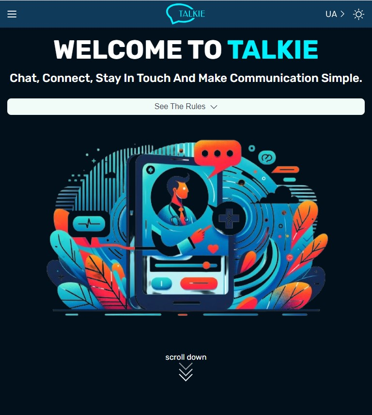

<h1 align="center">🙃 TALKIE  👉 <a href="https://teamchallenge-chat-api.onrender.com/api-docs/#/" target="_blank" rel="noreferrer">api-docs-link</a></h1>

<h2 align="center"><a href="https://talkiehub.netlify.app/" target="_blank" rel="noreferrer">TALKIE</a></h2>

Chat, Connect, Stay In Touch And Make Communication Simple.

<h2 align="center">This project was created using:</h2>

 &nbsp;
 &nbsp;
 &nbsp;

<h2 align="center">TALKIE 👉 
<a href="https://github.com/UlyanaKucherenko/TeamChallenge_Chat" target="_blank" rel="noreferrer">github-link</a></h2>

January 2024
